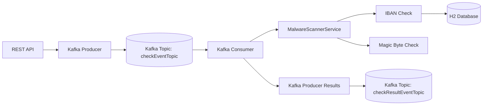

# Malware Document Scanner Kafka

[](https://github.com/stasolsh/melware-document-scanner-kafka/actions)
[](https://codecov.io/gh/stasolsh/melware-document-scanner-kafka)


> Event-driven Spring Boot application for asynchronous document validation and IBAN scanning using Apache Kafka.

Event-driven Spring Boot application for asynchronous document validation and IBAN scanning using Apache Kafka.

---

# Overview

Malware Document Scanner Kafka is an event-driven Spring Boot application designed to validate and scan uploaded documents asynchronously using Apache Kafka.

The system demonstrates how distributed backend services can process document verification workflows using messaging infrastructure, asynchronous communication, and modular validation pipelines.

The current implementation focuses on:

* PDF document processing
* IBAN extraction
* Blacklisted IBAN validation
* Kafka-based event streaming
* Distributed scan result processing
* Centralized exception handling
* Integration testing
* Docker-based local environment

The project is designed as both a learning and portfolio project demonstrating:

* Event-driven architectures
* Kafka messaging
* Spring Boot microservice patterns
* Distributed processing
* Asynchronous workflows
* Integration testing
* CI/CD and code coverage automation

---

# Features

* Asynchronous document processing
* Kafka-based event streaming
* PDF IBAN extraction
* Blacklisted IBAN detection
* Distributed processing pipeline
* Centralized exception handling
* Integration testing
* Docker-based local environment
* CI/CD automation
* JaCoCo test coverage reporting

---

# Architecture



---

# Event Flow

1. Client sends document scan request via REST API
2. Application publishes `CheckEvent` to Kafka
3. Kafka consumer receives event asynchronously
4. Scanner service executes all registered checks
5. IBANs are extracted from PDF documents
6. Extracted IBANs are validated against blacklist database
7. Scan results are published back to Kafka

---

# Technology Stack

| Technology      | Purpose                   |
| --------------- | ------------------------- |
| Java 17         | Main programming language |
| Spring Boot 3   | Backend framework         |
| Apache Kafka    | Event streaming           |
| Spring Kafka    | Kafka integration         |
| Maven           | Build tool                |
| Docker          | Containerization          |
| H2 Database     | Local persistence         |
| Spring Data JPA | Database access           |
| PDFBox          | PDF text extraction       |
| JUnit 5         | Testing                   |
| Mockito         | Mocking                   |
| JaCoCo          | Test coverage             |
| GitHub Actions  | CI/CD                     |
| Codecov         | Coverage reporting        |

---

# Core Components

| Component                  | Responsibility                               |
| -------------------------- | -------------------------------------------- |
| DownloadTestDataController | Accepts scan requests via REST               |
| KafkaProducer              | Publishes scan events to Kafka               |
| KafkaConsumer              | Consumes scan events and triggers validation |
| MalwareScannerService      | Orchestrates all scanning checks             |
| CheckIbanService           | Performs IBAN validation                     |
| PdfDocumentTypeProcessor   | Extracts IBANs from PDF documents            |
| BlacklistedIbanDao         | Checks blacklisted IBANs in database         |
| ControllerExceptionHandler | Centralized exception handling               |

---

# REST API

## Submit scan request

### Request

```http
POST /downloadTestData
Content-Type: application/json
```

### Payload Example

```json
[
  {
    "url": "file:///var/www/html/TestDataWithoutSuspicious.pdf",
    "fileType": "PDF"
  },
  {
    "url": "file:///var/www/html/TestDataWithSuspicious.pdf",
    "fileType": "PDF"
  },
  {
    "url": "file:///var/www/html/NotExistingPdf.pdf",
    "fileType": "PDF"
  }
]
```

---

# Kafka Events

## Input Event

```json
{
  "url": "file:///var/www/html/TestDataWithSuspicious.pdf",
  "fileType": "PDF"
}
```

## Output Event

```json
[
  {
    "name": "IBAN_CHECK",
    "state": "suspicious",
    "details": "Blacklisted IBAN detected: DE15300606010505780780"
  }
]
```

---

# Database

The application stores blacklisted IBANs inside the database.

Current demo values:

```text
DE15300606010505780780
UPC82771401621500311
124343433444444444444
```

---

# Local Development

## 1. Start infrastructure

Go to:

```text
/docker-local
```

Run:

### Windows

```bash
run.bat
```

### Linux / MacOS

```bash
./run.sh
```

---

## 2. Start Spring Boot application

```bash
mvn spring-boot:run
```

---

## 3. Send test payload

Use any REST client:

```http
POST http://localhost:9091/downloadTestData
```

---

## 4. Read Kafka verification results

```bash
kafka-console-consumer \
  --bootstrap-server localhost:9092 \
  --topic checkResultEventTopic \
  --from-beginning
```

---

## 5. Stop infrastructure

### Windows

```bash
stop.bat
```

### Linux / MacOS

```bash
./stop.sh
```

---

# Testing

The project contains:

* Unit tests
* Spring Boot integration tests
* Kafka integration tests
* Repository integration tests
* PDF processing tests

## Run tests

```bash
mvn clean test
```

## Generate coverage report

```bash
mvn clean verify
```

Coverage report location:

```text
coverage-report/target/site/jacoco-aggregate/index.html
```

---

# CI/CD

The project uses GitHub Actions for:

* Maven build
* Automated testing
* JaCoCo coverage generation
* Codecov integration

Pipeline automatically runs on:

* push
* pull request

---

# Design Patterns & Concepts

This project demonstrates:

* Event-Driven Architecture
* Producer/Consumer Pattern
* Strategy Pattern
* Dependency Injection
* Service Layer Pattern
* Repository Pattern
* Asynchronous Processing
* Centralized Exception Handling

---

# Example Workflow

```text
REST Request
    ↓
Kafka Producer
    ↓
Kafka Topic
    ↓
Kafka Consumer
    ↓
MalwareScannerService
    ↓
IBAN Validation
    ↓
Database Check
    ↓
Kafka Result Topic
```

---

# Future Improvements

Planned improvements:

* Virus signature scanning
* ClamAV integration
* OCR support for scanned PDFs
* Support for DOC/DOCX documents
* Distributed microservice deployment
* Kubernetes deployment manifests
* Retry and dead-letter Kafka topics
* Observability with Prometheus & Grafana
* OpenTelemetry tracing
* Authentication & authorization
* AWS deployment
* Redis caching
* Distributed tracing

---

# Author

Stanislav Olshanskyi

Senior Java Backend Engineer
Cloud-Native & Distributed Systems Enthusiast
